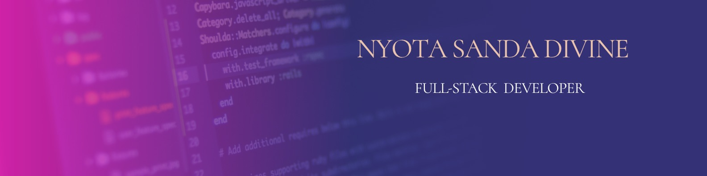

# Nyota Sanda Divine

  

  <strong>Computer  Engineer Student </strong>

  
  
  
  

Full Stack Developer focused on building modern, responsive, and scalable web applications, with expertise in developing complete solutions from front-end design to back-end development and deployment.

### Focus Areas

* **Full Stack Development** — Building responsive and scalable web applications from front end to back end.

* **Front-End Development** — HTML, CSS, JavaScript, and modern frameworks.
* **Back-End Development** — APIs, databases, server-side programming, and authentication.
* **Software Engineering** — Writing clean, maintainable, and efficient code.
* **AI & Machine Learning** — Exploring how AI can be integrated into software applications.
* **Web Application Development** — Designing and developing real-world applications from idea to deployment.

## Currently Learning:

- HTML
- CSS
- Java Script
- Github
- Git
- C++

## Tech Stack

     

## 📊 GitHub Analytics

| Repository Stats | Top Languages |
| --- | --- |
|  |  |

## 🐍 Contributions

## Collaboration

Open to collaborating on AI/ML projects, RAG and LLM systems, and practical data products.
